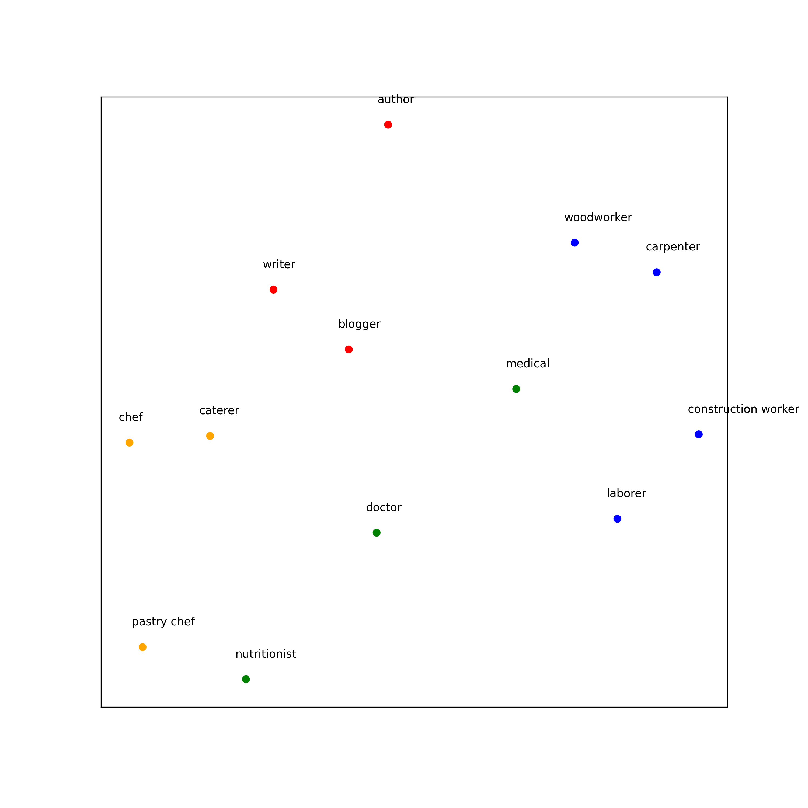

# job2vec
Open source model weights for Campfire AI's semantic embedding of human occupations

# Getting Started
Please use Python 3.8 or later. Install gensim and other dependencies with
```
pip install -r requirements.txt
```

# Running an example comparison
To start the jupyter notebook server, run 
```
jupyter notebook
```

This should open a window in your browser. If not, please follow the instructions printed by `jupyter` to locate the web URL to access the notebook page.
Click on the Job2vec notebook to access the example.



